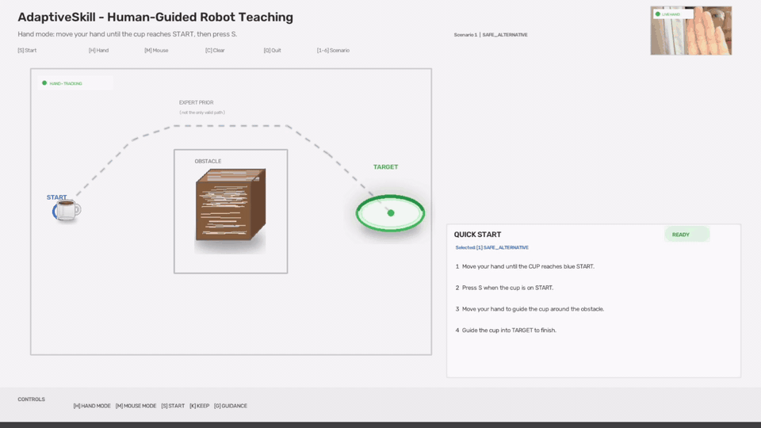
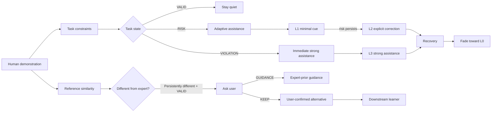
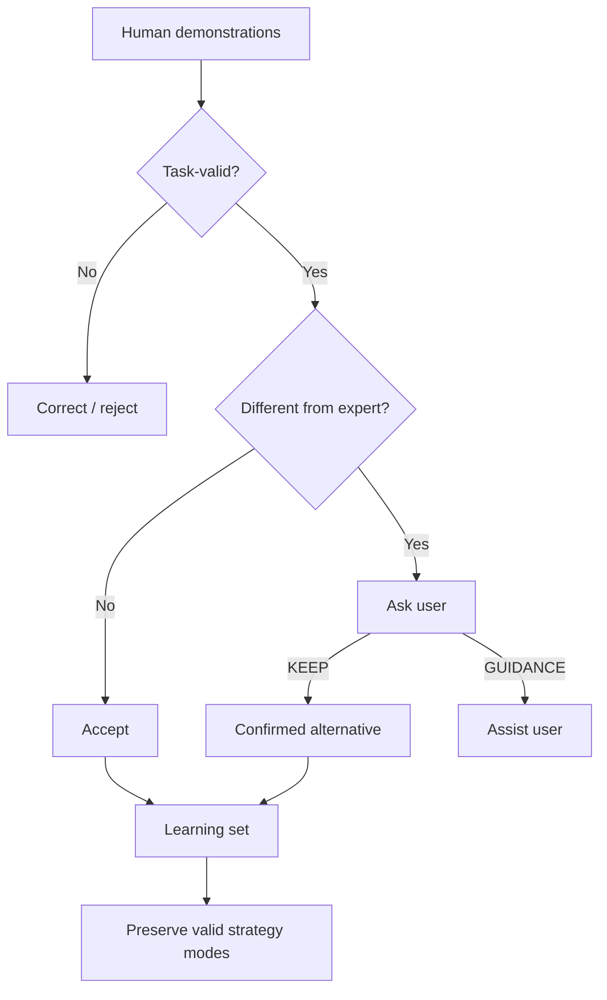

# AdaptiveSkill

### Task-aware adaptive assistance for human-centred robot teaching

> **Different from an expert demonstration does not necessarily mean wrong.**

AdaptiveSkill is an exploratory Human–Robot Interaction / Learning from Demonstration (LfD) prototype that separates **expert-reference similarity** from **task validity**. Instead of correcting every trajectory that differs from an expert prior, the system first asks whether the behaviour is still safe and task-valid, then provides the **minimum actionable assistance** needed.

**Current status:** exploratory research prototype · 2D embodied interaction · hand + mouse input · engineering validation


<p align="center">
  <a href="https://youtu.be/7QJb8Q6F7Vs">
    
  </a>
</p>

<p align="center">
  <em>Hand-controlled demonstration: a trajectory can differ from the expert prior while remaining task-valid. Click the preview to watch the full research demo.</em>
</p>

<p align="center">
  <strong>Full research demo:</strong>
  <a href="https://youtu.be/7QJb8Q6F7Vs">YouTube</a>
</p>

---

## Research question

**How can a robot-teaching interface distinguish between an error, an alternative task-valid strategy, and a genuine need for assistance — then intervene only as much as necessary while preserving user control?**

This question motivates the whole prototype.

A demonstration can be:

- different from an expert prior,
- still safe,
- still task-valid,
- and potentially valuable as an alternative teaching strategy.

AdaptiveSkill therefore does **not** use reference deviation as the sole definition of error.

---

## Why this project

Prior work in human-centred robot learning has already shown the value of:

- evaluating demonstration quality beyond task success,
- mixed-reality and AR feedback for robot teaching,
- UI interventions during Learning from Demonstration,
- assisted control and visual guidance,
- and real-time feedback for novice robot teachers.

AdaptiveSkill is **not** intended to re-claim those ideas as novel.

Instead, it focuses on a narrower follow-up problem:

> **When is intervention actually warranted?**

The prototype operationalises three distinctions:

1. **Reference deviation ≠ task error**
2. **Task risk ≠ hard constraint violation**
3. **Persistent valid difference ≠ inferred user intention**

When the system cannot know why a task-valid user is following a different strategy, it asks the user rather than pretending to infer intent.

---

## Core interaction

The demo uses a controlled 2D manipulation task:

- move a virtual cup from **START** to **TARGET**,
- avoid an obstacle,
- preserve task validity,
- and teach through either hand or mouse input.

### Input modes

**Hand mode**
- MediaPipe hand tracking
- index fingertip controls the virtual cup
- used as the embodied interaction mode
- 2D hand orientation is **not** treated as ground-truth object orientation

**Mouse mode**
- controlled validation input
- supports repeatable policy testing
- allows orientation manipulation with keyboard controls

The two modes share the same task evaluator and assistance policy.

---

## System overview



---

## Assistance policy

AdaptiveSkill uses four assistance levels.

| Level | Meaning | Trigger | User-facing behaviour |
|---|---|---|---|
| **L0** | Observe | Task-valid behaviour | No corrective guidance |
| **L1** | Minimal cue | New task risk | Short directional/orientation cue |
| **L2** | Explicit correction | Persistent task risk | Safe waypoint / explicit correction |
| **L3** | Strong assistance | **Hard task-constraint violation** | Immediate strong task-safe correction |

### Important policy choice

A true obstacle/task violation is treated as a **hard constraint**:

```text
VALID         -> L0
RISK          -> L1
RISK persists -> L2
VIOLATION     -> L3 immediately
RECOVERY      -> L3 -> L2 -> L1 -> L0
```

This keeps low-level assistance progressive while making hard safety violations immediately visible and actionable.

---

## Preserving alternative valid strategies

A reference-only system can mistake a valid alternative strategy for an error.

```text
Expert prior
START ───────╮
             ╰──────── TARGET

Alternative valid strategy
START ──╮
        ╰───────────── TARGET
```

If both routes satisfy the task constraints, AdaptiveSkill can remain quiet even when the alternative route is far from the expert prior.

### Reference-only baseline

```text
Different from reference
        ↓
    INTERVENE
```

### AdaptiveSkill

```text
Different from reference
        ↓
Check task validity
        ↓
VALID
        ↓
STAY QUIET
```

The expert trajectory is therefore treated as an **expert prior**, not as the only correct path.

---

## Human-in-the-loop intent clarification

A persistent task-valid deviation may still be ambiguous.

AdaptiveSkill does **not** infer the user's intention from trajectory deviation, hesitation, or other behavioural proxies.

Instead, it asks:

```text
DIFFERENT, BUT TASK-VALID

This path differs from the expert demonstration.
Was this intentional?

[K] KEEP MY STRATEGY
[G] SHOW GUIDANCE
```

### KEEP

The user explicitly confirms that the alternative route is intentional.

The strategy remains subject to task constraints, and future risk can still trigger assistance.

### GUIDANCE

The user explicitly requests help from the expert prior.

This is logged as **user-requested guidance**, not as an automatically detected error.

---

## Three policy conditions

The prototype supports transparent comparison between three assistance policies.

### A. Reference-only baseline

Uses deviation from the expert prior as the intervention trigger.

### B. Task-aware binary baseline

- VALID → quiet
- RISK / VIOLATION → full correction

This is a stronger comparator than reference matching because it already knows task constraints, but it does not adapt assistance intensity.

### C. AdaptiveSkill

- distinguishes VALID / RISK / VIOLATION,
- uses L0–L3 adaptive assistance,
- escalates only when warranted,
- immediately responds to hard violations,
- and fades assistance after recovery.

---

## Engineering evidence

> **Important:** the results below are engineering validation, not a formal user study.

### 1. Predefined runtime scenarios

Six predefined scenarios were used to exercise the intended policy behaviours:

| Scenario | Intended behaviour |
|---|---|
| Safe alternative | Preserve a valid strategy that differs from the expert prior |
| Brief risk | Minimal assistance, then return to quiet |
| Persistent risk | Escalate from minimal to explicit correction |
| Orientation-risk check | Exercise orientation-related guidance logic |
| Violation + recovery | Strong intervention followed by recovery |
| Persistent violation | Maintain strong assistance until recovery |

Each scenario achieved at least one protocol-valid run exhibiting the intended behaviour. Invalid, aborted, and unsuccessful runs were retained rather than silently removed.

### 2. Same-trace policy comparison

On six protocol-valid recorded traces:

- the reference-only baseline intervened during some task-valid behaviour,
- the binary task-aware baseline gave full correction whenever risk/violation existed,
- AdaptiveSkill redistributed assistance across minimal, explicit, and strong guidance.

**AdaptiveSkill exposed approximately 26% less explicit/strong corrective guidance than the binary task-aware baseline on the same recorded traces.**

This result is an **offline policy-exposure comparison**.

It does **not** demonstrate reduced cognitive workload, improved learning, trust, preference, or causal behavioural benefit.

### 3. Downstream strategy-preservation test

Six human mouse demonstrations were collected:

- **3 UPPER** safe routes
- **3 LOWER** safe routes

A lightweight trajectory learner preserved the two strategy modes separately.

Result:

```text
UPPER demonstrations -> UPPER prototype -> task-valid
LOWER demonstrations -> LOWER prototype -> task-valid

UPPER + LOWER naive averaging
        ↓
mixed trajectory
        ↓
obstacle violation
```

This does not claim a novel robot-learning algorithm.

It demonstrates a narrower downstream consequence:

> **collapsing distinct valid human strategies into a single averaged trajectory can create an invalid behaviour.**

---

## Why strategy preservation may matter downstream

The interaction policy and the learner are connected by a simple idea:



The aim is not only to make the interface less intrusive, but to avoid prematurely discarding useful variation in human demonstrations.

---

## Hand-input design decision

Early technical probes examined a 2D wrist-to-middle-MCP orientation proxy.

The position signal was sufficiently usable for the embodied demo, but natural obstacle-avoidance motion overlapped substantially with subjectively mild deliberate hand tilt.

For this reason, the current hand-controlled demo uses:

> **fingertip position as the embodied input, without claiming that a monocular 2D hand-angle proxy is ground-truth object orientation.**

This is a deliberate scope decision rather than an attempt to overstate sensing accuracy.

---

## What AdaptiveSkill does **not** claim

The current prototype does **not** claim:

- physical robot validation,
- full 3D or 6-DoF manipulation,
- robot inverse kinematics or dynamics,
- learned optimal assistance thresholds,
- automatic understanding of human intention,
- improved trust,
- reduced cognitive load,
- improved human learning,
- generalisation across users or tasks,
- or a novel machine-learning algorithm.

These boundaries are intentional.

The contribution of the current artifact is primarily the **interaction policy and research framing**.

---

## Why a 2D prototype?

The 2D workspace is a controlled abstraction used to isolate the assistance-allocation problem.

A full physical robot system would simultaneously introduce:

- 6-DoF pose estimation,
- inverse kinematics,
- joint limits,
- reachability,
- collision geometry,
- camera depth uncertainty,
- and robot dynamics.

Those are important research problems, but they can obscure the question being tested here:

> **Should the system intervene at all, and if so, how much?**

The current prototype therefore separates the decision policy from the complexity of a full robotic embodiment.

---

## Natural next research step

The most direct extension is to transfer the policy to **3D / physical robot teaching**.

### 1. 6-DoF task validity

Replace the 2D task state with constraints over:

- end-effector position,
- object pose,
- roll / pitch / yaw,
- reachability,
- robot/environment collision,
- and task-specific safety.

### 2. Empirical HRI evaluation

A future study could compare:

| Condition | Research question | Candidate measures |
|---|---|---|
| Continuous full guidance vs adaptive minimal guidance | Can equivalent task quality be achieved with less corrective exposure? | task success, intervention time, recovery time, NASA-TLX |
| Reference-forcing vs task-valid + intent clarification | Does preserving valid alternatives reduce unnecessary correction? | override frequency, unnecessary interventions, task efficiency, agency |
| No fading vs recovery-based fading | Does withdrawing support improve later independent performance? | post-feedback performance, assistance dependence |
| Rule-based vs learned/uncertainty-aware intervention | Can the system learn when assistance is warranted? | calibration, intervention precision/recall, task outcomes |

These are **future research questions**, not claims supported by the current prototype.

---

## Relationship to prior work

AdaptiveSkill is positioned as a **follow-up question** to existing work in human-centred robot learning rather than as a replacement for it.

Relevant research includes:

- **User Interface Interventions for Improving Robot Learning from Demonstration** — HAI 2023
- **Beyond Success: Quantifying Demonstration Quality in Learning from Demonstration** — IROS 2024
- **Mr.LfD: A Mixed Reality Interface for Robot Learning from Demonstration** — OzCHI 2024
- **Assisting MoCap-Based Teleoperation of Robot Arm using Augmented Reality Visualisations** — HRI 2025
- **Design and Evaluation of AR-Based Real-Time Feedback System for Kinesthetic Robot Teaching** — DIS 2026

These works establish that demonstration quality, interface intervention, AR/MR feedback, and visual assistance are important in robot teaching.

AdaptiveSkill focuses on the complementary question:

> **How should a system decide whether a difference deserves correction, what the smallest useful intervention is, and when control should be returned to the human?**

Selected research context:

- Wafa Johal — Publications: https://wafa.johal.org/publications/
- Human-Centered Robot Learning project: https://wafa.johal.org/projects/hurl/
- Real-Time Feedback for Kinesthetic Robot Teaching: https://muhammadbilal.com.au/feedback-system/

---

## Repository structure

```text
AdaptiveSkill/
│
├── demo/
│   └── robot_teaching_demo.py
│
├── task/
│   ├── task_config.json
│   └── task_constraints.py
│
├── guidance/
│   ├── correction_guidance.py
│   ├── scaffolding_controller.py
│   └── scaffolded_guidance.py
│
├── interaction/
│   ├── intervention_comparator.py
│   ├── policy_baselines.py
│   └── intent_manager.py
│
├── vision/
│   ├── hand_tracker.py
│   └── hand_input_adapter.py
│
├── rollout/
│   ├── simple_trajectory_learner.py
│   └── train_real_demonstrations.py
│
├── metrics/
│   ├── assistance_metrics.py
│   ├── runtime_logger.py
│   ├── analyze_runtime_trials.py
│   └── compare_policy_baselines.py
│
├── data/
│   ├── runtime_trials/
│   ├── policy_comparison/
│   └── learner_validation/
│
└── assets/
    ├── ui/
    └── demo/
        └── adaptiveskill_demo.gif
```

---

## Running the demo

### Clone

```bash
git clone https://github.com/LLy0910/AdaptiveSkill.git
cd AdaptiveSkill
```

### Create a virtual environment

Windows PowerShell:

```powershell
python -m venv .venv
.\.venv\Scripts\Activate.ps1
```

### Core dependencies

```powershell
pip install numpy opencv-python mediapipe
```

### Run

```powershell
python demo\robot_teaching_demo.py
```

---

## Controls

| Key | Action |
|---|---|
| `H` | Hand input |
| `M` | Mouse input |
| `S` | Start / restart trial |
| `K` | Keep my strategy |
| `G` | Show guidance |
| `C` | Clear |
| `Q` | Quit |
| `1–6` | Select validation scenario |
| `A / D` | Rotate cup in mouse mode |
| `R` | Return cup upright in mouse mode |

---

## Reproducibility and logging

The prototype logs runtime traces and trial summaries for later analysis.

Logged information includes:

- task state,
- obstacle risk / violation,
- reference distance,
- intervention decisions,
- assistance level,
- presentation mode,
- recovery behaviour,
- user intent-confirmation events,
- task outcome,
- and trial-level intervention metrics.

Invalid and aborted runs are preserved to avoid presenting only successful executions.

---

## Current contribution in one sentence

> **AdaptiveSkill is an exploratory robot-teaching prototype that separates task validity from expert-reference similarity, preserves user-confirmed alternative strategies, and provides progressively stronger — but withdrawable — task-relevant assistance, with immediate strong intervention for hard constraint violations.**

---

## Research outlook

The current prototype is deliberately small.

The next question is not simply how to add more feedback.

It is:

> **Can an assistive robot-teaching system learn when intervention is actually useful, preserve meaningful diversity in human teaching strategies, and still guarantee task-relevant safety in a real 3D robot setting?**
